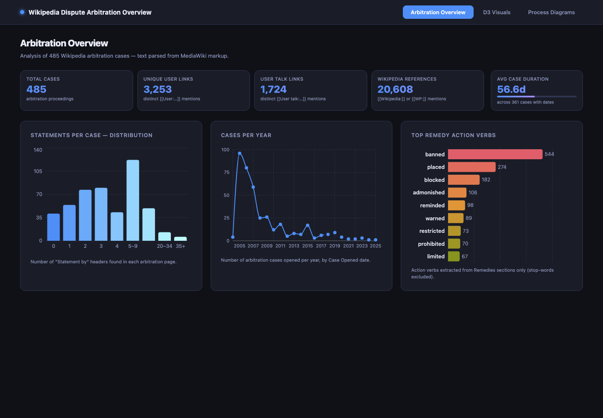

# Wikipedia Dispute Models

[](https://github.com/rah-ds/Wikipedia_Dispute_Models/actions/workflows/ci.yml)


**Wikipedia Dispute Models** is a UVA MSDS capstone project for mapping how
Wikipedia conflicts move from local discussion to formal Arbitration Committee
(ArbCom) remedies. The repository combines public Wikimedia data collection,
process modeling, feature extraction, graph construction, and a React dashboard
for inspecting dispute lifecycles.

The project is intentionally transparent: raw case records are preserved,
processed payloads are reproducible, and current handoff gaps are documented in
[`docs/handoff.md`](docs/handoff.md).

---

## Handoff status

Current repository audit:

| Artifact | Count | Notes |
| --- | ---: | --- |
| Canonical English Wikipedia ArbCom cases | 481 | Source: `artifacts/arb_cases.txt` |
| Raw per-case arbitration JSON records | 481 | One JSON record exists for every listed case |
| Usable arbitration/lifecycle records | 472 | Have ArbCom pages, revisions, and observed lifecycle data |
| Zero-data records needing follow-up | 9 | See `docs/handoff.md` |
| D3 JSON files | 466 | Includes `manifest.json`; see `docs/data_dictionary.md` |
| Collected revisions | 129,677 | From raw per-case summaries |
| Extracted participant mentions | 22,255 | From raw per-case summaries |
| Extracted article mentions | 14,826 | From raw per-case summaries |

Lifecycle coverage should be interpreted as **collection coverage**, not as a
claim that disputes truly skipped earlier venues. See
[`docs/handoff.md`](docs/handoff.md) for the zero-data case list, lifecycle
stage distribution, implementation notes, and handoff priorities.

---

## What this repository contains

| Area | What it does | Key files |
| --- | --- | --- |
| Data collection | Fetches ArbCom cases, revisions, participants, disputed articles, noticeboard mentions, and lifecycle evidence from Wikimedia APIs | `scripts/pull.py`, `src/wiki.py`, `src/arbitration.py`, `src/lifecycle.py` |
| Process modeling | Generates BPMN-style models for ArbCom, DRN, and RfC workflows | `scripts/bpmn_from_arb.py`, `scripts/bpmn_from_drn.py`, `scripts/bpmn_from_rfc.py`, `scripts/arbitration_bpmn_hf.py` |
| Analysis features | Builds edit-war, outcome, evidence-diff, participant, article, timeline, and graph features | `src/analysis.py`, `src/outcome.py`, `src/evidence.py`, `src/timeline.py`, `src/graph.py`, `scripts/build_features.py` |
| Dashboard exports | Converts enriched case records into D3/React dashboard payloads | `scripts/export_d3_all.py`, `scripts/process_arbitration_for_dashboard.py`, `data/processed/d3/` |
| Web dashboard | Provides interactive views of coverage, cases, BPMN diagrams, and D3 visuals | `dashboard/` |
| HPC pipeline | Runs large, resumable collection jobs on UVA Rivanna with SLURM | `scripts/slurm/`, `docs/rivanna_guide.md` |

---

## Quick start

### 1. Install prerequisites

- Python 3.11+
- [uv](https://docs.astral.sh/uv/)
- Node.js 20+ for the dashboard
- Git LFS for large data artifacts
- Optional but recommended: a Wikimedia API token

```bash
git clone https://github.com/rah-ds/Wikipedia_Dispute_Models.git
cd Wikipedia_Dispute_Models

# Pull LFS-backed raw/processed data if your clone did not do so automatically.
git lfs pull

# Create a local environment and install project + development dependencies.
uv venv
source .venv/bin/activate
make setup
```

If you have Wikimedia credentials, copy the example environment file and fill
in the values:

```bash
cp .env.example .env
```

For authenticated Wikimedia requests, make sure your `.env` also includes
`WIKIPEDIA_ACCESS_TOKEN`. If `.env.example` does not already contain that
variable, add it manually after copying the file.

### 2. Validate the Python project

```bash
make test-unit
make lint
```

The CI workflow also runs pre-commit checks, Python unit tests, type checking,
and the dashboard lint/build pipeline.

### 3. Run the dashboard

```bash
# Rebuild the dashboard data payload if needed.
uv run python scripts/process_arbitration_for_dashboard.py

# Start the React dashboard at http://localhost:5173.
make dashboard
```

The dashboard reads from `dashboard/public/data/dashboard_data.json`. BPMN
assets in `dashboard/public/bpmn/` and D3 exports in `data/processed/d3/` are
used by the case and visualization views.



---

## Common workflows

### Fetch data

The unified pull runner is the safest entry point for resumable local pulls:

```bash
make pull                 # sample config
make pull CONFIG=dev      # minimal development pull
make pull CONFIG=full     # larger full pull
make pull-status
make pull-reset
```

Direct script access is also available:

```bash
uv run python scripts/pull.py --config sample
uv run python scripts/pull.py --dry-run
uv run python scripts/pull.py --validate
```

### Regenerate features and dashboard exports

```bash
uv run python scripts/build_features.py --dry-run
uv run python scripts/build_features.py

uv run python scripts/export_d3_all.py --workers 4
uv run python scripts/process_arbitration_for_dashboard.py
```

Use `--force` with `export_d3_all.py` when you want to overwrite existing D3
payloads after a data fix.

### Generate BPMN artifacts

```bash
# Rule-based ArbCom BPMN and aggregate model.
uv run python scripts/bpmn_from_arb.py --input data/raw/arbitration --output artifacts/bpmn/arb --max-cases 20

# Hugging Face NER-assisted ArbCom BPMN.
uv run python scripts/arbitration_bpmn_hf.py --case "Wikipedia:Requests_for_arbitration/-Ril-"
uv run python scripts/arbitration_bpmn_hf.py --aggregate

# DRN and RfC generators.
uv run python scripts/bpmn_from_drn.py
uv run python scripts/bpmn_from_rfc.py
```

The project supports three BPMN-generation styles:

1. **Deterministic structural extraction** for fast, reproducible aggregate
   diagrams.
2. **BERT-assisted labeling** for better actor/task labels inside a stable
   process skeleton.
3. **Hybrid language-model branching** for high-fidelity case studies where
   principles, findings, remedies, amendments, and enforcement events become
   separate process elements.

### Enrich evidence diffs and negative-class data

```bash
uv run python scripts/enrich_evidence_diffs.py --dry-run
uv run python scripts/enrich_evidence_diffs.py --case "Gamergate"

make fetch-declined-dry
make fetch-declined
```

Declined ArbCom requests are intended as a future negative class for escalation
modeling. They should not be mixed with accepted ArbCom cases without clear
labels.

---

## Repository layout

```text
.
|-- artifacts/              # Case lists, generated BPMN/results, logs
|-- dashboard/              # React + Vite dashboard
|-- data/
|   |-- raw/                # LFS-backed API records and case JSON
|   `-- processed/          # LFS-backed feature tables and dashboard payloads
|-- docs/                   # API, graph, Rivanna, lifecycle, and progress docs
|-- notebooks/              # Exploratory notebooks
|-- scripts/                # CLI scripts for collection, export, BPMN, HPC
|-- src/                    # Reusable Python package code
`-- tests/                  # Unit and integration tests
```

Large raw and processed data artifacts are tracked through Git LFS via
`.gitattributes`. If a JSON file looks like a small LFS pointer instead of real
data, run `git lfs pull`.

---

## Documentation

| Document | Purpose |
| --- | --- |
| [`docs/handoff.md`](docs/handoff.md) | Detailed handoff audit, current gaps, module notes, and next priorities |
| [`docs/data_dictionary.md`](docs/data_dictionary.md) | Definitions for raw records, usable data, D3 payloads, dashboard data, and feature tables |
| [`docs/dashboard.md`](docs/dashboard.md) | Dashboard tabs, data inputs, D3/BPMN loading, and troubleshooting |
| [`docs/wikipedia_dispute_resolution_lifecycle.md`](docs/wikipedia_dispute_resolution_lifecycle.md) | Dispute escalation process and venue mapping |
| [`docs/wikimedia_api.md`](docs/wikimedia_api.md) | Wikimedia API reference used by the project |
| [`docs/graph_schema.md`](docs/graph_schema.md) | Editor/article/case graph schema and planned Wikidata enrichment |
| [`docs/rivanna_guide.md`](docs/rivanna_guide.md) | UVA Rivanna setup and SLURM collection workflow |

---

## Rivanna HPC workflow

You do need to be logged into the UVA network.

Large-scale collection can run on UVA Rivanna. Configure `RIVANNA_ID` in
`.env`, set up SSH access, then use:

```bash
make rivanna-sync
make rivanna-setup
make rivanna-submit
make rivanna-status
make rivanna-logs
make rivanna-pull
```

The SLURM pipeline is dependency ordered:

| Stage | Script | Purpose |
| --- | --- | --- |
| 1 | `update_arb_cases.slurm` | Refresh canonical ArbCom case list |
| 2 | `fetch_full.slurm` | Fetch broad article/dispute data |
| 3 | `fetch_arb_dfs.slurm` | Collect ArbCom case pages and linked pages |
| 4 | `fetch_lifecycle.slurm` | Reconstruct dispute lifecycle stages |
| 5 | `pipeline_summary.slurm` | Send progress summary |

See `docs/rivanna_guide.md` for setup details, logging paths, and recovery
steps. Current limitations and next priorities are tracked in
[`docs/handoff.md`](docs/handoff.md).

---

## Ethics and responsible use

This project uses public Wikimedia records, but editor names, sanctions, and
dispute histories can still be sensitive when aggregated. Use the data for
governance analysis, reproducibility, and process understanding. Avoid ranking
or targeting individual volunteers. Any future predictive model should be
evaluated for false positives, contestability, and chilling effects on
good-faith participation.

---

## AI disclosure

Generative AI tools were used as assistants during portions of this project,
including code review, documentation drafting, LaTeX editing, and repository
handoff cleanup. The team remains responsible for the final analysis, claims,
code, and documentation. AI-generated suggestions were reviewed against the
repository state and public Wikimedia data before inclusion.

---

## Project links

- Repository: <https://github.com/rah-ds/Wikipedia_Dispute_Models>
- Wikimedia API documentation: <https://www.mediawiki.org/wiki/API:Main_page>
- Wikipedia dispute resolution: <https://en.wikipedia.org/wiki/Wikipedia:Dispute_resolution>
- BPMN 2.0 specification: <https://www.omg.org/spec/BPMN/2.0.2/>

---

## Team

| Role | Name |
| --- | --- |
| Authors | Louis Cocks, Katherine Kelleher, Ryan Healy |
| Program | UVA School of Data Science, MSDS DS 6015 Capstone, including Professor Rafael Alvarado |
| Sponsor | Lexipedia |
| Subject-matter feedback | Lane Raspberry and Anson Parker |

---

## License

This repository is released under the MIT License. See `LICENSE`.
