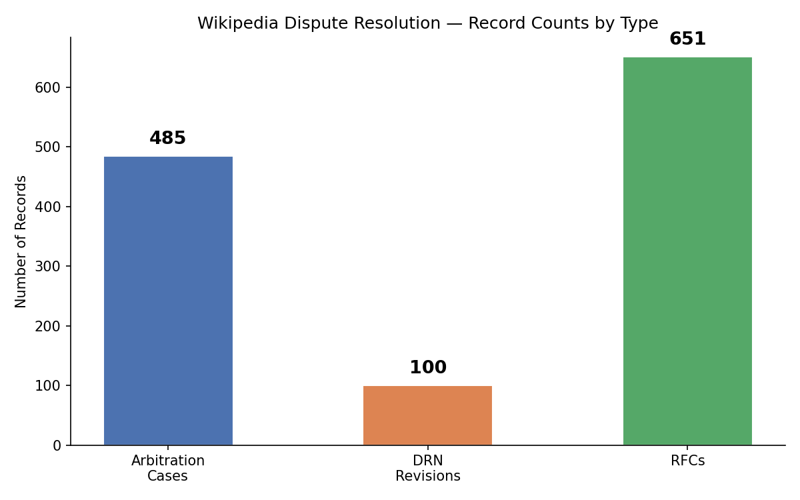

# Handoff Notes

This document records the current repository state for the final project
handoff. It is the detailed companion to the top-level `README.md`.

## Current corpus audit

| Artifact | Count | Notes |
| --- | ---: | --- |
| Canonical English Wikipedia ArbCom cases | 481 | Source: `artifacts/arb_cases.txt` |
| Raw per-case arbitration JSON records | 481 | One JSON record exists for every listed case |
| Usable arbitration/lifecycle records | 472 | Have ArbCom pages, revisions, and observed lifecycle data |
| Zero-data records needing follow-up | 9 | Listed below |
| D3 JSON files | 466 | Includes `manifest.json`; see `docs/data_dictionary.md` |
| Collected revisions | 129,677 | From raw per-case summaries |
| Extracted participant mentions | 22,255 | From raw per-case summaries |
| Extracted article mentions | 14,826 | From raw per-case summaries |

The broader venue-count chart below is useful for presentations, but it is not
the canonical source for ArbCom coverage. Use the table above for final handoff
counts and the chart only as a high-level view of collected dispute-resolution
record types.



Zero-data records to inspect or refetch:

- `CoolKatt number 99999`
- `FuelWagon v. Ed Poor`
- `Highways 2`
- `Historical elections`
- `Historicity of Jesus`
- `Koavf`
- `Sathya Sai Baba`
- `SchuminWeb`
- `Waterboarding`

Lifecycle-stage coverage should be interpreted as collection coverage, not as
a claim that disputes truly skipped earlier venues:

| Observed lifecycle stages | Cases |
| ---: | ---: |
| 0 | 9 |
| 1 | 456 |
| 2 | 7 |
| 3 | 7 |
| 4 | 2 |

## Handoff priorities

1. Repair or manually inspect the nine zero-data records.
2. Regenerate D3/dashboard payloads so processed coverage matches raw usable
   coverage.
3. Validate outcome parsing against a hand-labeled sample before treating
   sanctions or remedies as ground-truth labels.
4. Keep declined ArbCom requests separate from accepted cases; they are useful
   as a future negative class for escalation modeling.
5. Improve earlier-stage matching for Talk, RfC, DRN, and ANI archives before
   making claims about whether cases skipped lower venues.

See [`data_dictionary.md`](data_dictionary.md) for definitions of "usable",
`lifecycle_stages_with_data`, D3 payloads, dashboard data, feature tables, and
coverage files that should or should not be used for final counts.

## Implementation notes for maintainers

- `src/wiki.py` uses direct MediaWiki REST/action API calls through
  `requests.Session`, with optional OAuth bearer-token support. The main
  collection path no longer depends on Pywikibot.
- `scripts/pull.py` and `src/pull_state.py` are designed for interruption:
  pulls save per-item status and can resume after failures or `Ctrl+C`.
- `src/models.py` and `src/lifecycle.py` encode the key modeling assumption:
  the same editors can appear across Talk, DRN, ANI, and ArbCom venues, so
  temporal co-occurrence is a core escalation signal.
- `src/evidence.py` and `scripts/enrich_evidence_diffs.py` target
  `Special:Diff` links from ArbCom evidence pages. These links point to the
  concrete edits cited as evidence, which makes them especially valuable for
  future label validation.
- `scripts/build_features.py` prioritizes enriched arbitration JSON over older
  Arb-DFS or lifecycle-only files when rebuilding `data/processed/features.*`.
- `scripts/export_d3_all.py` writes both per-case D3 payloads and a
  `manifest.json` that records successes and failures, so a failed export can
  be audited without rerunning the whole batch.

## Core modules

| Module | Purpose |
| --- | --- |
| `src/wiki.py` | MediaWiki API client with authentication, rate limiting, retry logic, and pagination helpers |
| `src/arbitration.py` | ArbCom case discovery, path resolution, page collection, participant extraction, and article extraction |
| `src/lifecycle.py` | Lifecycle reconstruction across Talk, DRN, ANI, and ArbCom evidence |
| `src/outcome.py` | ArbCom finding, principle, remedy, sanction, and vote parsing |
| `src/evidence.py` | Evidence-page `Special:Diff` extraction and enrichment |
| `src/analysis.py` | Revert/edit-war features and conflict summaries |
| `src/timeline.py` | Case timeline construction and escalation features |
| `src/graph.py` | NetworkX `MultiDiGraph` builder for editor, article, and case relationships |
| `src/network.py` | Graph analysis utilities and projections |
| `src/ores.py` | Wikimedia ORES/Lift Wing score client |
| `src/pageviews.py` | Wikimedia Pageviews API client |
| `src/xtools.py` | XTools API client for editor and article summaries |
| `src/pull_config.py` | YAML-backed pull presets for `sample`, `dev`, and `full` collection |
| `src/pull_state.py` | Resumable pull state with per-item progress tracking |

The graph layer uses typed editor, article, and ArbCom-case nodes with edges
such as `REVERTS`, `EDITS_CASE`, `EDITS_ARTICLE`, `SUBJECT_OF`, and
`CO_OCCURS`. See `docs/graph_schema.md` for the full schema and planned
Wikidata enrichment.

## Current limitations

- The corpus is ArbCom-centered, so it overrepresents severe or long-running
  disputes.
- Earlier-stage venues are harder to reconstruct retrospectively because old
  Talk, RfC, DRN, and ANI records are archived under changing conventions.
- Nine listed cases currently have raw JSON records but no usable ArbCom pages
  or revisions.
- Dashboard exports currently cover 466 cases; regenerate D3 payloads after
  repairing zero-data records.
- Outcome parsing is useful for exploration, but sanctions and remedies should
  be hand-validated before being used as ground-truth labels.
- Escalation prediction requires a negative class of non-escalated or declined
  disputes.

## Useful validation commands

```bash
make test-unit
make lint
cd dashboard && npm install && npm run lint && npm run build
```

Use `git lfs pull` if raw or processed data files appear as small pointer files
instead of JSON/CSV content.
