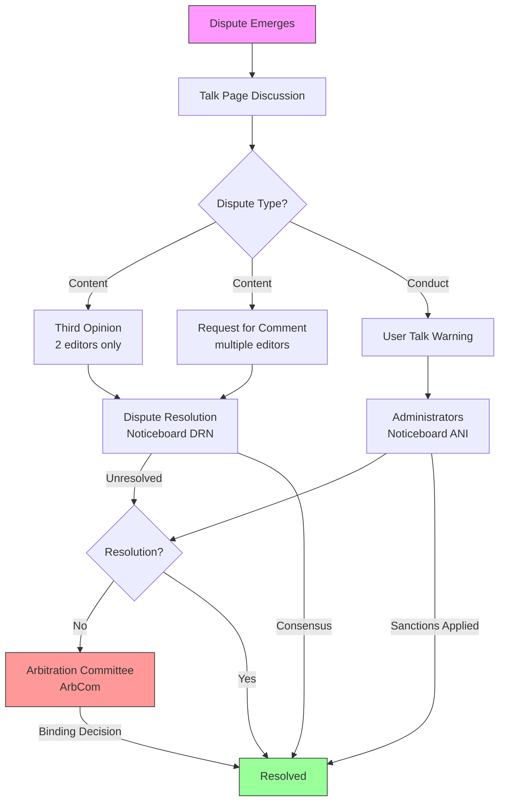

# The Wikipedia Dispute Resolution Lifecycle

## Abstract

Wikipedia's dispute resolution system governs how volunteer editors resolve conflicts over article content and editor conduct. This document analyzes the five-stage escalation pathway—from talk page discussion to binding arbitration—drawing on official Wikipedia policy documentation. The system balances editorial autonomy against the need for authoritative intervention, employing graduated responses that reserve formal processes for intractable disputes.

---

## 1. Introduction

Wikipedia operates on consensus: volunteer editors collaborate to produce accurate, neutral, and verifiable content (Wikipedia, 2024a). Yet open editing inevitably generates conflict. Editors disagree about source interpretation, due weight, and policy application. These disagreements require structured resolution.

The English Wikipedia distinguishes **content disputes** (concerning article text) from **conduct disputes** (concerning editor behavior) (Wikipedia, 2024a). Each follows a distinct pathway, though the two often intersect—content disagreements frequently generate incivility or edit warring.

This document maps the complete dispute lifecycle, from informal negotiation through binding arbitration.

---

## 2. Theoretical Framework

Wikipedia's system employs **graduated intervention**: responses escalate in formality and binding force as lower-level mechanisms fail. Four values compete:

1. **Autonomy**: Editors should resolve disputes themselves when possible.
2. **Efficiency**: Formal processes consume resources; reserve them for intractable conflicts.
3. **Legitimacy**: Decisions must reflect consensus, not administrative fiat.
4. **Finality**: Some mechanism must terminate disputes that resist resolution.

The system distinguishes **facilitative** processes (mediation: third parties guide without deciding) from **adjudicative** processes (arbitration: authorized bodies issue binding decisions) (Wikipedia, 2024f).

---

## 3. Stage One: Talk Page Discussion

### 3.1 Primary Venue

Editors must first attempt resolution through direct dialogue on the article's talk page (Wikipedia, 2024a). Talk pages serve to:

- Discuss proposed changes before implementation
- Explain rationales for contested edits
- Seek clarification on opposing positions
- Propose compromises

### 3.2 Behavioral Expectations

Editors must:

- **Assume good faith**: Presume others aim to improve the encyclopedia (Wikipedia, 2024a)
- **Remain civil**: Maintain respect despite disagreement (Wikipedia, 2024a)
- **Focus on content**: Address the text, not the editor

### 3.3 When Direct Negotiation Fails

Negotiation fails when:

- Discussion stalls without progress
- Positions become entrenched
- Communication breaks down
- Arguments repeat without engagement

The Dispute Resolution Noticeboard requires "extensive discussion on a talk page (not just through edit summaries)"—typically "more than one post by each editor" over "at least two days" (Wikipedia, 2024c).

---

## 4. Stage Two: Third-Party Input

### 4.1 Third Opinion (3O)

When two editors reach impasse, either may request a Third Opinion—an uninvolved volunteer's perspective (Wikipedia, 2024d).

**Characteristics:**

- Limited to exactly two disputants
- Non-binding advice, not decision
- Voluntary participation
- No formal proceedings

### 4.2 Requests for Comment (RfC)

For disputes involving multiple editors or requiring broader input, RfCs solicit structured community feedback (Wikipedia, 2024a).

RfCs suit situations where:

- Multiple editors hold conflicting positions
- Policy interpretation is unclear
- The issue affects articles beyond the immediate dispute

---

## 5. Stage Three: Dispute Resolution Noticeboard (DRN)

### 5.1 Role

DRN sits between Third Opinion and administrative intervention (Wikipedia, 2024c). Volunteer moderators—experienced editors without administrative powers—facilitate discussion and guide parties toward resolution.

### 5.2 Eligibility

DRN accepts only **content disputes**. The filing party must show:

1. Substantial talk page discussion occurred
2. No other venue is considering the dispute
3. The case does not involve AfD, Requested Moves, or similar processes

### 5.3 Process

A moderator structures discussion through:

1. **Zeroth statements**: Parties confirm willingness to participate
2. **Moderator statements**: Questions and proposed frameworks
3. **Editor responses**: Parties address the moderator's questions
4. **Iteration**: Discussion continues until resolution or closure

DRN operates under **Rule A** (no article edits during moderation) and **Rule B** (state what you want changed, not why the other party is wrong) (Wikipedia, 2024c).

### 5.4 Outcomes

Cases conclude with:

- **Consensus**: Agreement reached
- **Referral**: Directed to RfC, ANI, or other venue
- **Closure**: No resolution achieved

---

## 6. Stage Four: Administrative Intervention

### 6.1 Administrators' Noticeboard/Incidents (ANI)

Conduct violations—edit warring, incivility, disruption—go to ANI (Wikipedia, 2024b). Unlike content venues, administrators can impose binding sanctions:

- Warnings
- Topic bans
- Editing restrictions
- Blocks

### 6.2 Edit Warring and the Three-Revert Rule

Wikipedia prohibits edit warring: repeatedly reverting another editor to impose one's preferred version. The **Three-Revert Rule (3RR)** sets a bright line: more than three reverts on one page within 24 hours may result in a block (Wikipedia, 2024b).

However:

> "An editor may be blocked for edit warring even without violating the three-revert rule... The rule is not an entitlement." (Wikipedia, 2024b)

### 6.3 Discretion

Administrators weigh:

- Prior contributions and sanctions
- Severity and persistence of violation
- Whether the editor acknowledges wrongdoing
- Impact on the encyclopedia

---

## 7. Stage Five: Arbitration

### 7.1 The Arbitration Committee

The Arbitration Committee (ArbCom) is Wikipedia's court of last resort (Wikipedia, 2024e). It alone can issue binding conduct decisions and interpret contested policy.

### 7.2 Authority

ArbCom can:

- Issue binding findings of fact and policy conclusions
- Impose indefinite bans, topic bans, and editing restrictions
- Remove administrator rights
- Interpret policy
- Establish procedural rules for dispute categories

### 7.3 Limitations

ArbCom does **not**:

- Decide content: "The Committee does not rule on content"
- Serve as a content appeals court
- Accept cases that have not exhausted other options

### 7.4 Process

1. **Filing**: Request explaining the dispute and prior attempts
2. **Review**: Committee decides whether to accept
3. **Evidence**: Parties submit diffs, citations, analysis
4. **Workshop**: Draft findings and remedies
5. **Proposed decision**: Published for comment
6. **Final decision**: Binding upon passage

---

## 8. Content vs. Conduct Pathways

The system maintains distinct tracks:

**Content:**
Talk Page → Third Opinion/RfC → DRN → [Arbitration for policy interpretation only]

**Conduct:**
User Talk Page → ANI → Arbitration

### Hybrid Disputes

Most disputes involve both dimensions. A content disagreement escalates to conduct when editors begin edit warring. The conduct dimension must typically resolve before productive content discussion can resume.

---

## 9. Special Mechanisms

### 9.1 Mediation

Mediation involves "an uninvolved third party (who is the mediator)" whose "role is to guide discussion towards the formation of agreement" (Wikipedia, 2024f).

Key features:

- **Voluntary**: Parties may withdraw anytime
- **Facilitative**: The mediator guides but does not decide
- **Controlled venue**: Mediators may set procedural rules

### 9.2 General Sanctions

In persistent conflict areas (Arab-Israeli, climate change, certain national histories), ArbCom may impose **General Sanctions** applying to all editors in that topic, regardless of individual history.

### 9.3 Targeted Restrictions

- **Interaction bans**: Two editors prohibited from contact
- **Topic bans**: Editor barred from a subject area
- **Probation**: Heightened scrutiny, lower sanction thresholds

---

## 10. Strengths and Challenges

### Strengths

1. **Graduated response**: Resources match dispute severity
2. **Consensus preservation**: Multiple stages seek voluntary agreement before binding decisions
3. **Distributed authority**: Power dispersed among volunteers, administrators, arbitrators
4. **Transparency**: Public proceedings enable oversight

### Challenges

1. **Volunteer capacity**: Availability fluctuates
2. **Process fatigue**: Procedural complexity can exhaust opponents
3. **Boundary confusion**: Content and conduct distinctions blur
4. **Enforcement limits**: Sanctions target accounts; sock puppetry circumvents them

---

## 11. Conclusion

Wikipedia's dispute resolution lifecycle balances editorial autonomy against authoritative intervention through graduated escalation. The five-stage structure—talk page, third-party input, DRN, administrative action, arbitration—reserves formal processes for genuinely intractable disputes while preserving consensus-based resolution as the norm.

The system's separation of content and conduct pathways, combined with distributed authority among volunteers, administrators, and elected arbitrators, has enabled Wikipedia to maintain encyclopedic standards despite continuous conflict. Future research should examine resolution outcomes quantitatively and compare Wikipedia's model with governance mechanisms on other collaborative platforms.

---

## References

Wikipedia. (2024a). *Wikipedia:Dispute resolution*. Retrieved from https://en.wikipedia.org/wiki/Wikipedia:Dispute_resolution

Wikipedia. (2024b). *Wikipedia:Edit warring*. Retrieved from https://en.wikipedia.org/wiki/Wikipedia:Edit_warring

Wikipedia. (2024c). *Wikipedia:Dispute resolution noticeboard*. Retrieved from https://en.wikipedia.org/wiki/Wikipedia:Dispute_resolution_noticeboard

Wikipedia. (2024d). *Wikipedia:Third opinion*. Retrieved from https://en.wikipedia.org/wiki/Wikipedia:Third_opinion

Wikipedia. (2024e). *Wikipedia:Arbitration Committee*. Retrieved from https://en.wikipedia.org/wiki/Wikipedia:Arbitration_Committee

Wikipedia. (2024f). *Wikipedia:Mediation*. Retrieved from https://en.wikipedia.org/wiki/Wikipedia:Mediation

Wikipedia. (2024g). *Wikipedia:Administrators' noticeboard/Incidents*. Retrieved from https://en.wikipedia.org/wiki/Wikipedia:Administrators%27_noticeboard/Incidents

---

## Appendix A: Key Policy Shortcuts

| Shortcut | Full Name | Purpose |
|----------|-----------|---------|
| WP:DR | Dispute Resolution | Overview of dispute resolution options |
| WP:3O | Third Opinion | Requesting outside perspective for two-party disputes |
| WP:DRN | Dispute Resolution Noticeboard | Moderated content dispute resolution |
| WP:ANI | Administrators' Noticeboard/Incidents | Reporting conduct violations |
| WP:ARBCOM | Arbitration Committee | Final binding dispute resolution |
| WP:EW | Edit Warring | Policy on revert conflicts |
| WP:3RR | Three-Revert Rule | Bright-line edit warring standard |
| WP:RFC | Requests for Comment | Soliciting community input |
| WP:MEDIATE | Mediation | Facilitated discussion with neutral third party |

---
